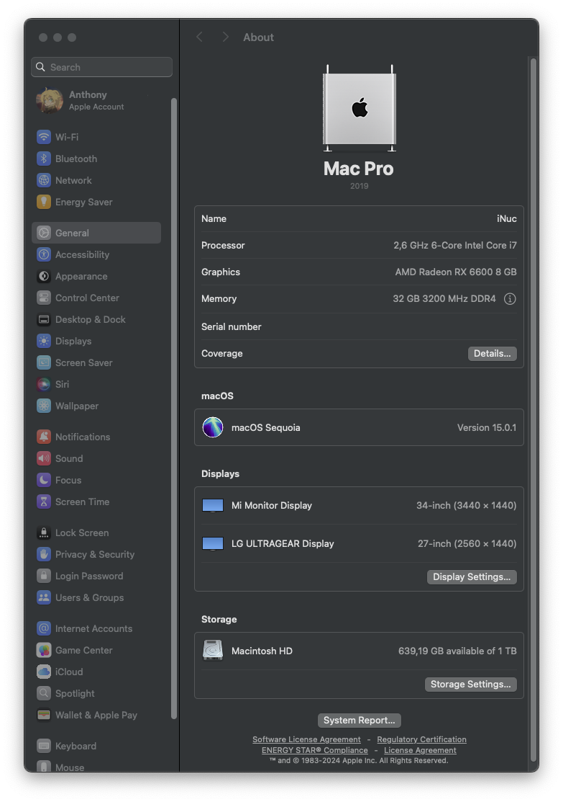

## OpenCore configuration (current OpenCore 1.0.1)
| Specifications | Details |
| :-------: | :---------------------------------------------: |
| Keyboard | english (ABC) |
| SMBios | MacPro7,1 |
| Ram | 2 physical sticks (3200mhz) and 10 emulated |

I use the SMBios `MacPro7,1` , because it is with the system that I have the least latency on the encode/decode part of the GPU (AMD GPU RX6600), which is very useful if you use monlight/parsec

## Computer configuration (current Sequoia 15.0.1)

| Specifications | Details |
| :-------: | :---------------------------------------------: |
| Computer model | Intel NUC9 `NUC9i5QNX` `NUC9i7QNX` `NUC9i9QNX` |
| Operating system | macOS `Sequoia` / `Sonoma` / `Ventura` / `Monterey` |
| Processor | Intel `i5-9300` / `i7-9750H` / `i9-9980HK` |
| Memory | 64 GB DDR4 2666-3200MHz |
| Hard disk 1/2/3 | Supports up to three m.2 NVMe |
| Graphics card | AMD discrete graphics (RX6600) / Intel UHD 630 **disabled**  |
| Display interface | Thunderbolt 3 x2 + HDMI 2.0a x1 (4K@60Hz) |
| Sound card | USB Audio Device |
| Wireless network card | m.2 NGFF slot, default factory setting is `Intel® Wi-Fi 6 AX200` |
| Wired network card | Intel® Ethernet Connection `i219-LM` / `i210-AT` |
| Card reader | SDXC |

## Thanks to daliansky
INFO: 90% of the work is based on: https://github.com/daliansky/Intel-NUC9-Hackintosh

## Screenshot

  

  
 
  
 
  
 
  

  

  
 
  

  
  
 